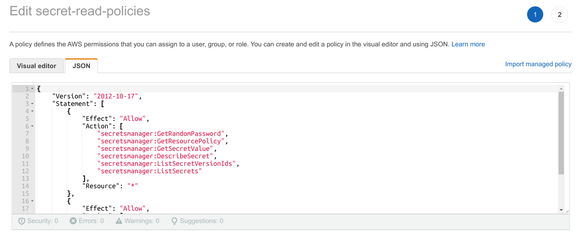
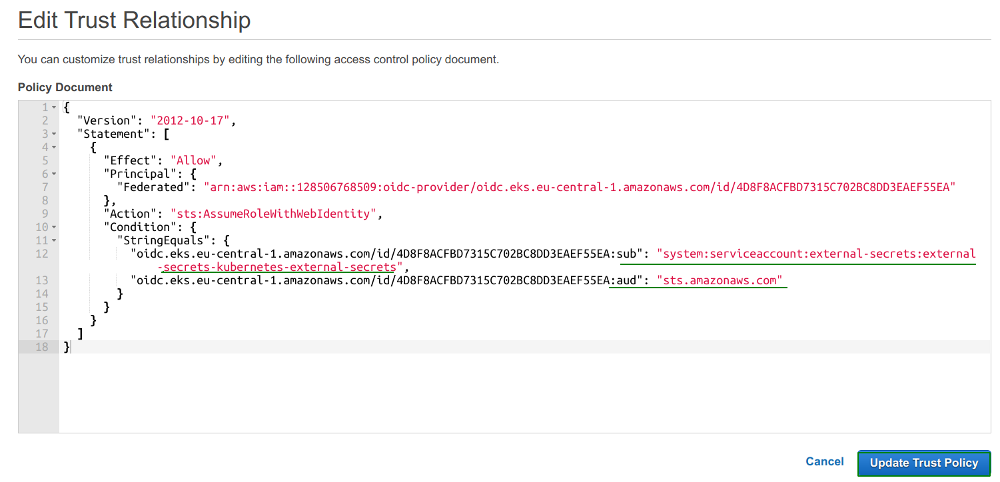

#### OpenID connect URL get from AKS








IAM role map with service account

```yaml
---
apiVersion: v1
kind: ServiceAccount
metadata:
  name: app
  namespace: default
  annotations:
    eks.amazonaws.com/role-arn: arn:aws:iam::128506768509:role/secret-read-role

```